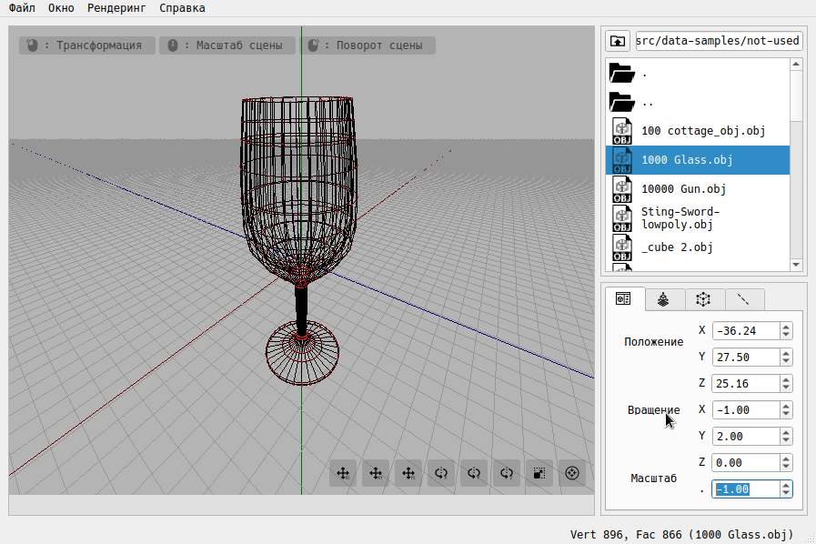

# 3d-viewer-app

[](https://www.qt.io)
[](https://www.open-std.org/jtc1/sc22/wg21/docs/papers/2017/n4659.pdf)
[](https://www.open-std.org/jtc1/sc22/wg14/www/docs/n1570.pdf)
[](https://www.opengl.org/resources/libraries/glut/glut_downloads.php)
[](https://www.qt.io)
[](https://www.qt.io)

Native application for viewing wireframe models. The models themselves loaded from files in .OBJ format and viewable on the screen with the ability to rotate, scale and translate.

---

<div align="center">
	
</div>

---

## Table of Contents

- [Requirements](#requirements)
- [Reminder](#reminder)
- [Features](#features)
- [Example](#example)
- [Build/Installation](#build/installation)
- [Usage](#usage)
- [Authors](#authors)

---

## Requirements

- MacOS or Linux.
- [CMake 3.17.5+](https://cmake.org/download)
- [Qt 5.15.3+ or Qt 6.0.0+](https://www.qt.io/download-qt-installer)
- [GLUT 3.7+](https://www.opengl.org/resources/libraries/glut/glut_downloads.php)

## Reminder

1. After you clone the repository, do not forget to initialize the local configuration file of the submodule and get all its data:

```bash
git submodule update --init --recursive
```

2. You also need to make sure that your system already has OpenGL installed:

```bash
glxinfo | grep 'OpenGL renderer string'
```

>GLFW purpose is to manage OpenGL contexts and basics of window-, keyboard-, event-handling.

>There is no such thing as an OpenGL SDK library. There is a file libGL.so , supplied with the driver. To use it, you need a binding to the programming language of your choice.

- [Linux] An approximate set of modules and utilities for working with OpenGL:

```bash
sudo apt-get install freeglut3 freeglut3-dev binutils mesa-common-dev build-essential
```

- [Mac OS X] Does not require installation.

3. QT

```bash
sudo apt install libxcb-cursor0
```

## Features

1. Basic functionality:

- Loading a wireframe model from an obj format file (supports only a list of vertices and faces).
- Moving the model by a specified.
distance relative to the X, Y, Z axes.
- Rotating the model by a given angle relative to its X, Y, Z axes.
- Scaling the model by a given value. 
- Control the rotation and scaling of the scene.

2. Optional:

- Selection of projection type (parallel and central).
- Selection of the type (solid, dotted), color and thickness of the faces.
- Selection of the display method (missing, circle, square), color and size of the vertexes.
- Background color selection.
- Saving rendered images to a file in bmp and jpeg formats.
- Recording gif animations (640x480, 10fps, 5s).

## Example 

1. Content of the type “file.obj”
```
v1 1.1 1.2 1.3
v2 2.1 2.2 2.3
v3 3.1 3.2 3.3

f1 1 2 3
f2 2 3 1

[other flags]
```

2. Struct *WireframeModel*

```c
typedef struct {
  int vrts_COUNT; /* Количество вершин v(x,y,z) */
  int fcs_COUNT;  /* Количество граней f(v1,v2,v3) */
  int vrt_MAX_INDEX; /* Максимальный индекс вершины в общем массиве
                       вершин всех граней (f1, f2 и тд) */
  int *num_vrts_forming_fc_ARR; /* Массив количества вершин каждой конкретной
                                    грани (f1, f2 и тд),
                                    т.е. количество вершин грани f1,
                                    количество вершин грани f2 и тд.*/
  int all_vrts_forming_fc_COUNT; /* Общее количество всех вершин,
                                     образующих каждую конкретную грань f1, f2,
                                    ... */
  double *crds_ARR; /* Массив, образованный последовательностью
                        координат [x11, x12, x13, x21, x22, x23, ...]
                        каджой заданной вершины (v1, v2, ...) в списке */
  Face *fcs_ARR; /* Массив, образованный последовательностью указателей
                     на массивы вершин каждой грани из списка */
  Center center_COORD; /* Координаты центра 3D-объекта */
  Axis axis_COORD; /* Определение областей на координатных осях x, y и z */
} WireframeModel;
```

- Number of vertexes v(x,y,z,[w])
```
    vrtxs_count = 3
```
- Number of faces f(v1,v2,v3)  
```
    fcs_count = 2
```
- Array of the number of vertices of each specific face (f1, f2, etc.), i.e. the number of vertexes of the face f1, the number of vertexes of the face f2, etc..
```
    num_vrtxs_forming_face_ARR = [3, 3]
```
- Maximum index in a group of records f1, f2, ..
```
    vrt_MAX_INDEX = 3
```
- The total number of all vertices forming each specific face f1, f2, ...
Their number may vary as garnishes can be triangular, square. A face can form 3 and 4 vertices. For this, we implement a mechanism for counting them.
```
    all_vrtxs_forming_faces_COUNT = 6
```
- An array forming a sequence of coordinates [x11, x12, x13, x21, x22, x23, ...] by any given vertex (v1, v2, ...) in the list
```
    coordinates_ARR = [1.1, 1.2, 1.3, 2.1, 2.2, 2.3, 3.1, 3.2, 3.3]
```
- Coordinates of the center of the geometric model
```
    center_COORD
```
- Determination of the maximum and minimum of the geometric model on the coordinate axes x, y and z
```
    axis_COORD
```
## Project structure

```
.
├── app
│   ├── resources
│   │   ├── fileicon 
│   │   ├── ttf 
│   │   ├── icons.png
│   │   └── [.]
│   ├── CMakeLists.txt
│   ├── explorer.cpp
│   ├── explorer.h
│   ├── main.cpp
│   ├── viewport.cpp
│   ├── viewport.h
│   ├── window.cpp
│   ├── window.h
│   ├── window.qrc 
│   └── window.ui 
├── data-samples 
│   ├── files.obj
│   └── [.]
├── kernel
│   ├── CMakeLists.txt
│   ├── dataset.c
│   ├── dataset.h
│   ├── transform.c
│   ├── transform.h
│   ├── utils.c
│   └── utils.h
├── submodules 
│   └── gif
│       └── gif.h
├── tests
│   ├── CMakeLists.txt
│   ├── 000.include
│   ├── dataset-wfmodel.check
│   ├── operation-with-io-file.che
│   ├── transformation-model.check
│   └── test-sample.obj
├── CMakeLists.txt
├── Makefile
├── doxyfile
└── README.md

```


1. In accordance with the requirements of the project, the following items are implemented by means of the C language and standard libraries:

- Reading format files .obj. 
- Initialization of data for constructing the geometry of a three-dimensional object.
- Athenian transformations on a three-dimensional object (moving, repeating, scaling).

> Path: [/kernel](kernel/CMakeLists.txt)

> CMake: Build static library

2. The graphical user interface consists of two parts: the area of rendering three-dimensional graphics, represented by the [Viewport] class and the control system and processing of input parameters for displaying wireframe models and layout, represented by the [Window] class.

> Path: [/app](app/CMakeLists.txt)

> CMake: Assembling the finished application

## Build/Installation

For a complete list of dependencies see the [ObjectDependencies.txt](ObjectDependencies.txt).

Simple install procedure:

```
$ make                                      # Build
[ Become root if necessary ]
$ make install                              # Installation
```

## Usage

The pre-launch of the program can be performed by the ‘run’ target

How to use application see manual.


